# RIP-Guided Graph Evidence for LLM-Based Equivalent Mutant Detection

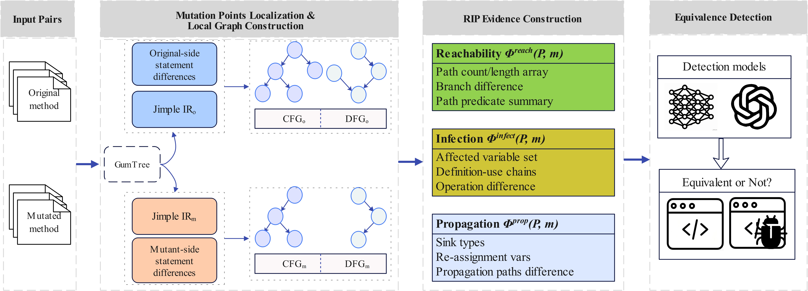

This repository contains the replication package for our work on equivalent-mutant detection that combines RIP-guided paired program-graph evidence with large language model reasoning. At the IR level, we align the original program and its mutant, extract CFG/DFG evidence (e.g., path predicates, def–use chains, and control/data dependences), and encode it into a structured prompt for stage-wise decision making.

---

**_Contact_**: Feel free to contact Xiangjuan Yao (yaoxj@cumt.edu.cn), Lei Hu (hulei172418@gmail.com), and Changqing Wei (1536113693@qq.com) if you have any further questions about the code.

## 1. Environment

- Platform: Ubuntu 22.04

- Python: 3.12

- Deep learning stack: PyTorch 2.5.1 + CUDA 12.4

- Instruction tuning: LoRA on 8-bit quantized base models; only adapter parameters and the output head are trained.

- Embedding-model fine-tuning: follows the official training recipes provided by the original model implementations.

- Hardware (local runs): 3× NVIDIA Tesla V100 (32GB each)

- OpenAI-model runs: do not consume local GPU resources.

- Dependency list: see requirements.txt

---

## 2. Dataset

### (1) Statistics of Java programs from 10 widely used open-source Java projects.

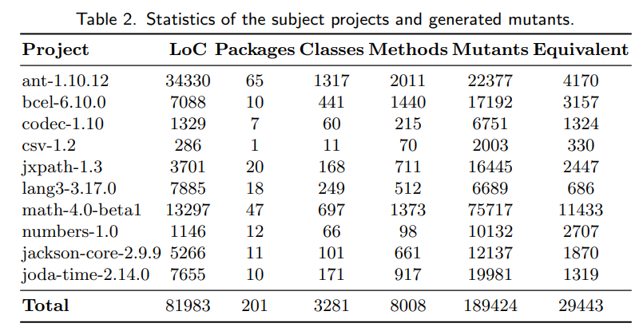
Table 2 statistics of the subject projects and generated mutants.
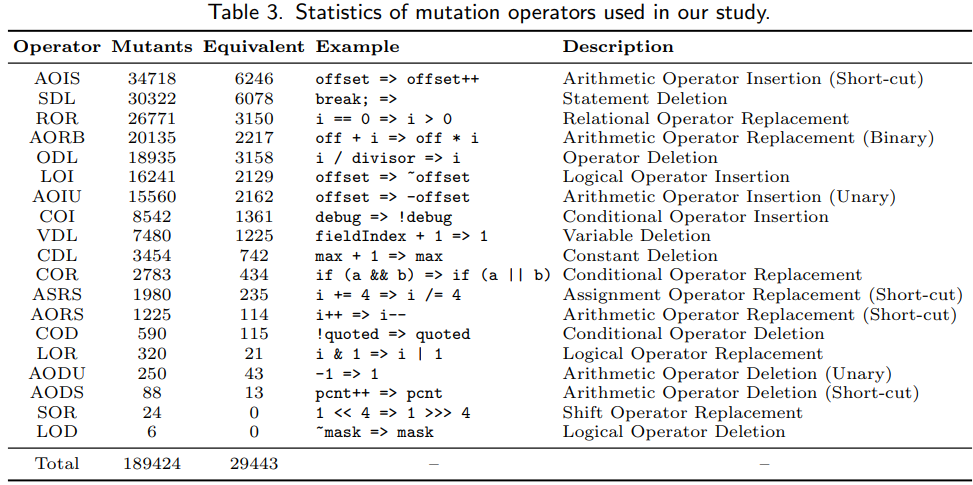

Table 3 summarizes the mutation operators used in our study. We consider 19 conventional mutation operators applied at the method level. They cover arithmetic, logical, conditional, relational, variable-level, and statement-level transformations. Within each project, mutants are randomly split into training, validation, and test sets with an 8:1:1 ratio.

### (2) How to access the dataset

All the pre-processed data used in our experiments can be downloaded from [`./dataset`](dataset).

---

## 3. Models

#### (1) How to access the models

All the models' checkpoints in our experiments can be downloaded from huggingface([link](https://huggingface.co/)).

#### (2) Code-pair Embedding

CodeBERT (125M) [[HF]](https://huggingface.co/microsoft/codebert-base/tree/main), GraphCodeBERT (125M) [[HF]](https://huggingface.co/microsoft/graphcodebert-base/tree/main), PLBART (140M) [[HF]](https://huggingface.co/uclanlp/plbart-base/tree/main), CodeT5 (220M) [[HF]](https://huggingface.co/Salesforce/codet5-base/tree/main), UniXCoder (125M) [[HF]](https://huggingface.co/microsoft/unixcoder-base/tree/main).

#### (3) RIP-evidence with LLMs

StarCoder (15.5B) [[HF]](https://huggingface.co/bigcode/starcoder/tree/main), Code Llama (34B) [[HF]](https://huggingface.co/codellama/CodeLlama-34b-hf/tree/main), Qwen2.5-Coder (32B) [[HF]](https://huggingface.co/Qwen/Qwen2.5-Coder-32B/tree/main), DeepSeek-Coder (33B) [[HF]](https://huggingface.co/deepseek-ai/deepseek-coder-33b-base/tree/main), GPT-3.5-Turbo [[OpenAI]](https://openai.com/), GPT-4 [[OpenAI]](https://openai.com/).

---

## 4. Experiment Replication

Please set up the environment by following Section 1 (**1. Environment**) and installing dependencies from requirements.txt.

For running GPT-4 / GPT-3.5 (OpenAI models), before starting inference, please add your OpenAI API credentials by filling in api_key and base_url in ./code/test_zsp.py, then run the corresponding scripts to perform zero-shot prompting inference on the test dataset.

### Demo

Before replicating the experiment results, ensure that you have placed 1 codebase file (i.e.,Mutant_db_rip.csv), and 3 mutant-pair files for training/validation/testing (i.e.,Mutant_A_rip.csv, Mutant_B_rip and Mutant_C_rip.csv) in the `../dataset` folder.

#### (1) Training

You can train the DeepseekCoder through the following commands:

```
cd EquivalentMutantsLLM\EquivDetect
python -m DeepseekCoder.code.train
```

Then, the program will automatically train the DeepseekCoder via SFT manner and do inference after training.

#### (2) Testing:

**Inference of Zero-shot Prompting**  
To run DeepseekCoder with Zero-shot Prompting to make inferences on the test dataset, run the following commands:

```
cd EquivalentMutantsLLM\EquivDetect
python -m DeepseekCoder.code.test_zsp
```

**Inference of Few-shot Prompting**
To run DeepseekCoder with Few-shot Prompting to make inferences on the test dataset, run the following commends:

```
cd EquivalentMutantsLLM\EquivDetect
python -m DeepseekCoder.code.test_fsp
```

**Inference of Fine-tuning with Instruction**  
Before performing inference with the instruction-tuned model, please return to `Step (1)` and run the train.py script to complete the LoRA fine-tuning of DeepseekCoder. The fine-tuned model parameters will be automatically saved in the `save_models/` directory.
After completing the training process, you can run the following command to perform inference:

```
cd EquivalentMutantsLLM\EquivDetect
python -m DeepseekCoder.code.test_ft
```

### How to run the remaining models and strategies

All the code can be accessed from respective directories.
Please find their README.md files to run respective models.

---

## 5. Experimental and Analysis

---

#### 1) How effective is the proposed approach at detecting equivalent mutants.

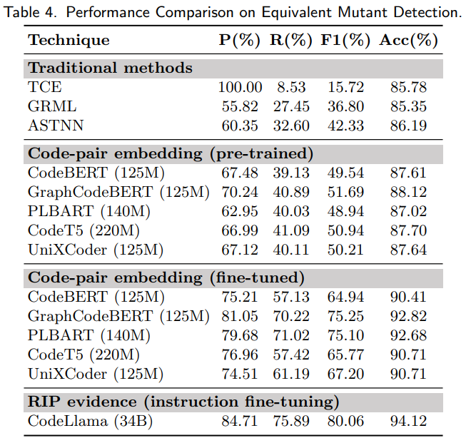

**Table 4** summarizes the overall detection performance (P/R/F1/Acc) of our RIP-guided approach against baselines on equivalent mutant detection.

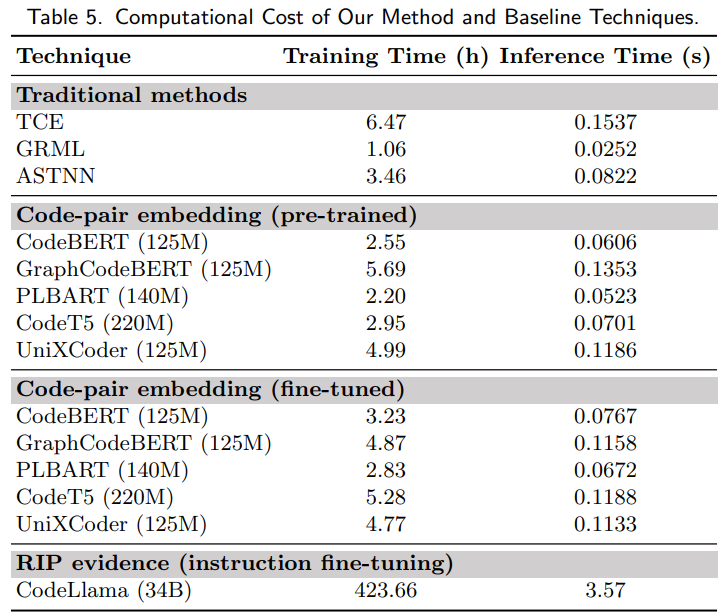

**Table 5** reports the computational cost (e.g., runtime/inference overhead) of our approach and baseline techniques, enabling a performance–cost comparison.

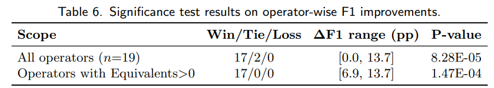

**Table 6** provides statistical significance results for operator-wise F1 improvements, showing whether gains are consistent across mutation operators.

---

#### 2) How does performance vary across mutation operators.

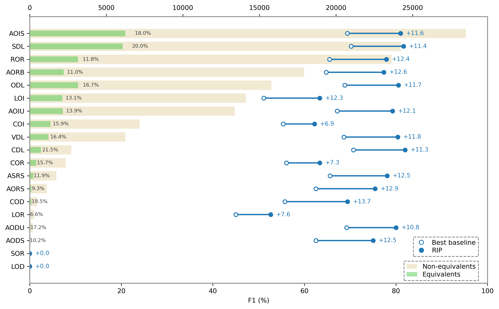

**Figure 6** compares RIP with the best-performing baseline on top operators, highlighting where RIP yields the largest per-operator improvements (and the operator’s equivalent ratio).


**Table 6** provides statistical significance results for operator-wise F1 improvements, showing whether gains are consistent across mutation operators.

---

#### 3) What are the performance--cost trade-offs across LLMs usage strategies.

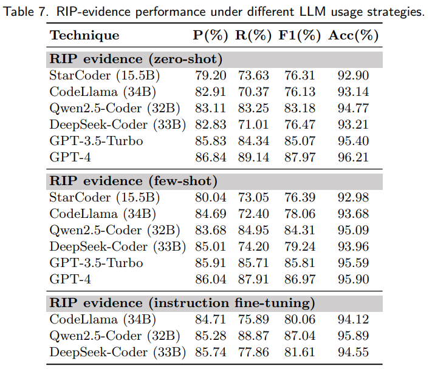

**Table 7** compares RIP-evidence effectiveness across LLM usage strategies (zero-shot, few-shot, and instruction tuning) to reveal performance–strategy trade-offs.

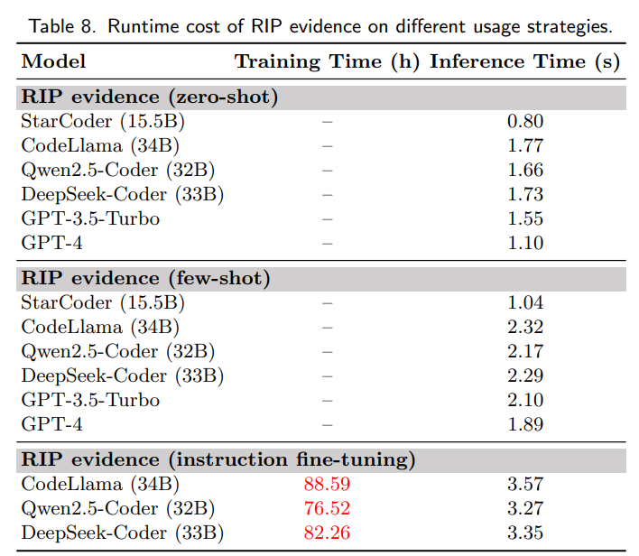

**Table 8** reports the runtime/cost breakdown of RIP evidence under different LLM usage strategies, quantifying the overhead of stronger settings.

---

#### 4) How well does the proposed approach generalize under cross-project evaluation).

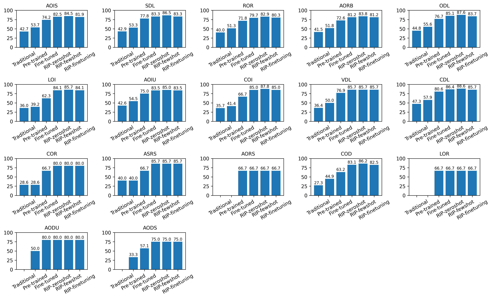

**Figure 7** visualizes cross-project generalization results, showing how performance changes when testing on a held-out project rather than the training project(s).

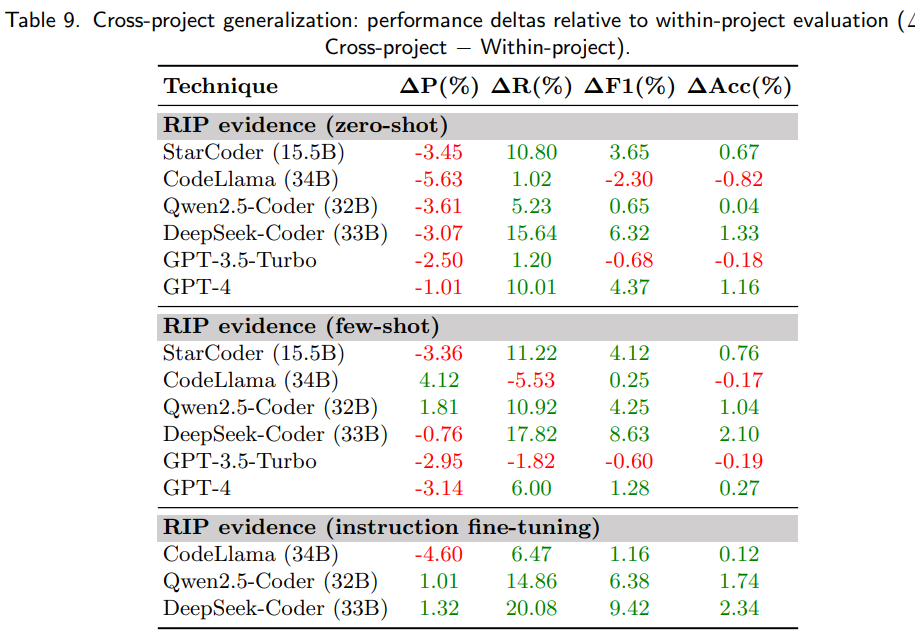

**Table 9** summarizes cross-project generalization as performance deltas (cross-project minus within-project), indicating which techniques degrade most under transfer.

---

## 6. Discussion

---

#### 1) Overall Impact of RIP-Structured Evidence

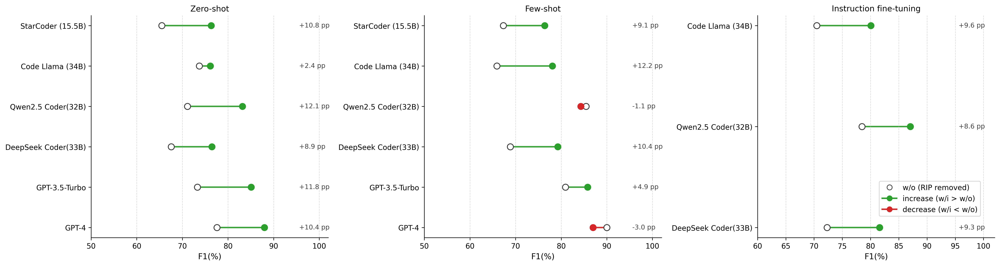

**Figure 8** isolates the overall benefit of adding RIP-structured evidence by comparing F1 with vs. without the evidence across LLM strategies.

---

#### 2) Contribution of RIP Evidence Components

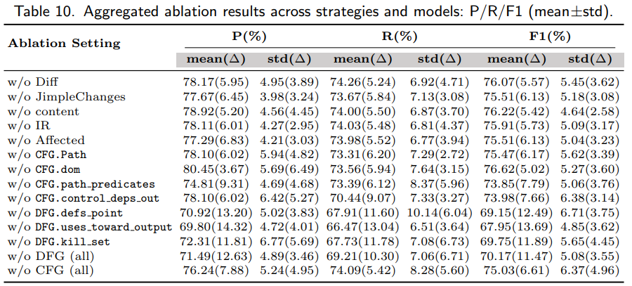

**Table 10** aggregates ablation results to quantify how much each evidence component (e.g., Diff/CFG/DFG) contributes to precision/recall/F1.

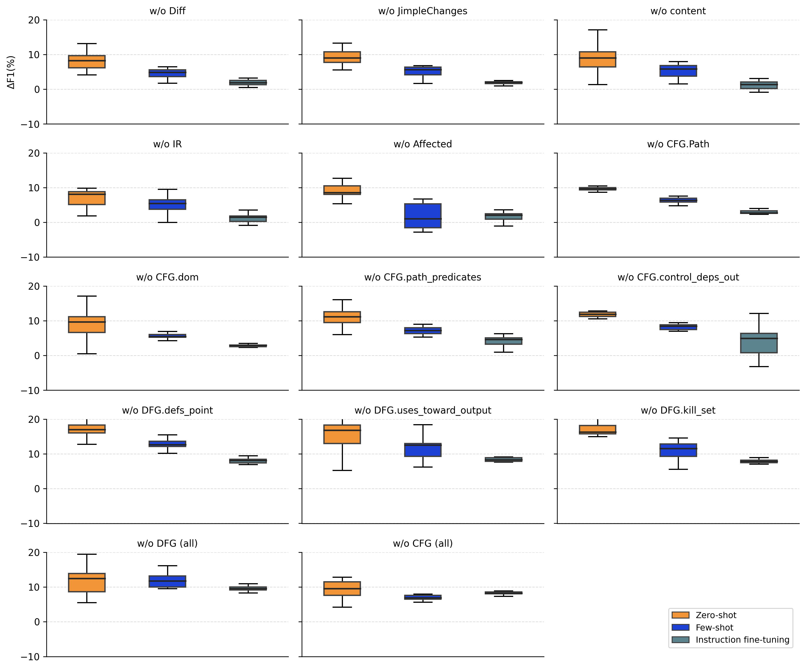

**Figure 9** shows the distribution of ΔF1 when removing each evidence field, helping identify which fields are most critical vs. redundant.

---

#### 3) Token Budgeting and Input Truncation for RIP Evidence

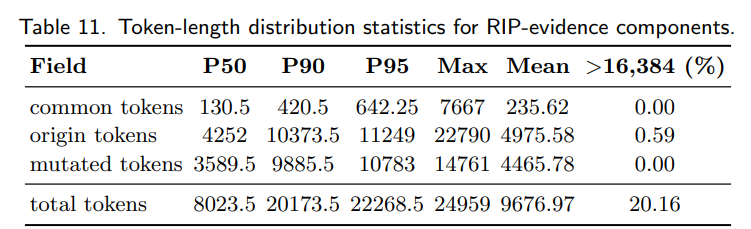

**Table 11** reports token-length statistics of RIP evidence components to characterize prompt-length drivers and truncation risk.

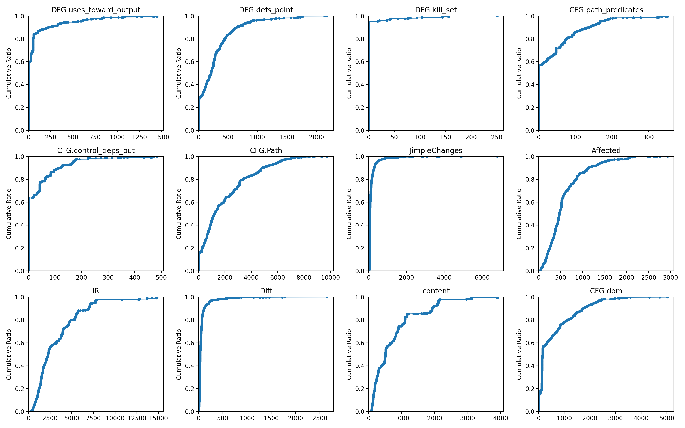

**Figure 10** plots ECDFs of token lengths per evidence component, revealing long-tail components that frequently cause budget overruns.

---

#### 4) Failure Modes and Sources of Misclassification

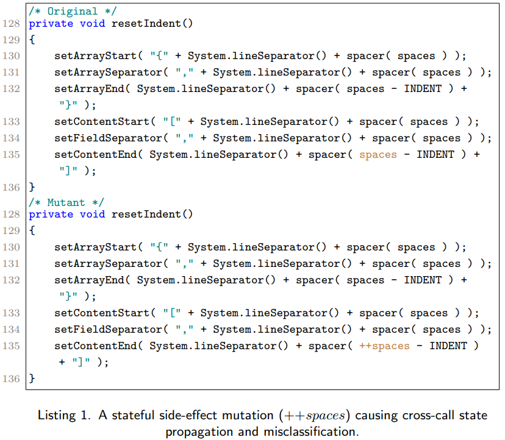

**Listing 1** presents a representative misclassified case (stateful side-effect mutation) to explain a common failure mode of evidence-based reasoning.

---

#### 5) Operator-Level Limitations

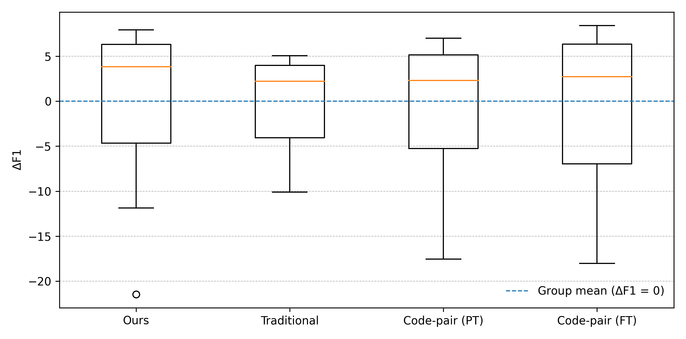

**Figure 11** summarizes operator-level limitations by showing how each operator’s F1 deviates from the technique-family mean.

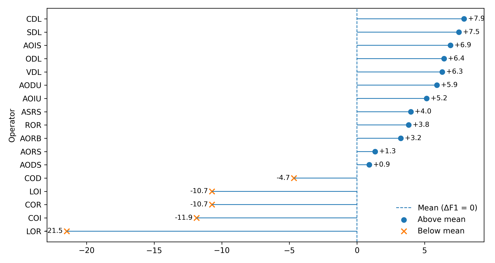

**Figure 12** compares per-operator F1 against the overall mean of our method to highlight operators where performance is systematically weaker/stronger.

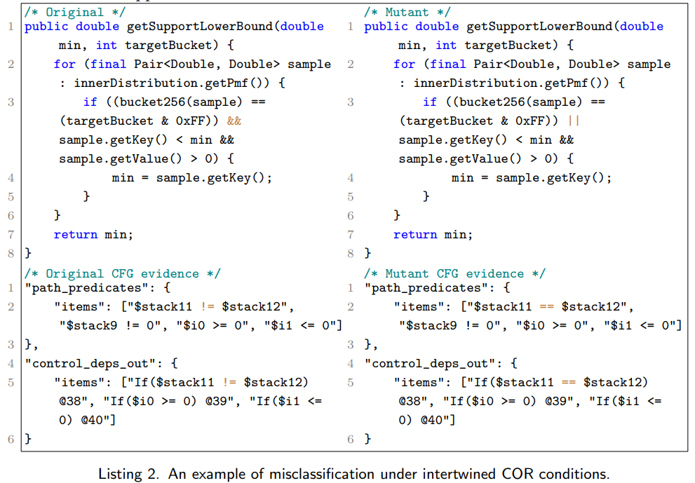

**Listing 2** shows a misclassified case with intertwined conditions to illustrate challenging equivalence patterns not well captured by the current evidence scope.

---

## 7. Implementation (Code Availability)

The main contributions of this study are as follows:

1. **RIP-guided paired graph evidence for equivalent mutant detection.**  
   We propose an equivalent mutant detection framework guided by the RIP perspective. The framework jointly models the original program and its mutant as aligned CFGs, DFGs, and IR structures. It extracts paired graph evidence (e.g., path predicates and def–use chains) and constructs interpretable, structured prompts to guide LLMs to learn and reason about equivalence along the three RIP dimensions.  
   **Implementation:** https://anonymous.4open.science/anonymize/RIPMutDete-D5AD/

2. **Tool support for multiview program-graph construction and static evidence extraction.**  
   We implement a prototype toolchain that maps source-level differences onto CFGs and DFGs, performs static analysis along mutation-relevant paths, and produces a unified structured input interface that can be readily consumed by different types of LLMs.  
   **Implementation:** https://anonymous.4open.science/r/ParseRIP-8B58/

---
